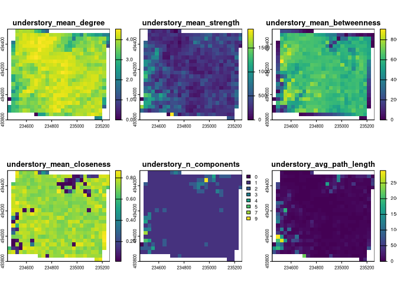
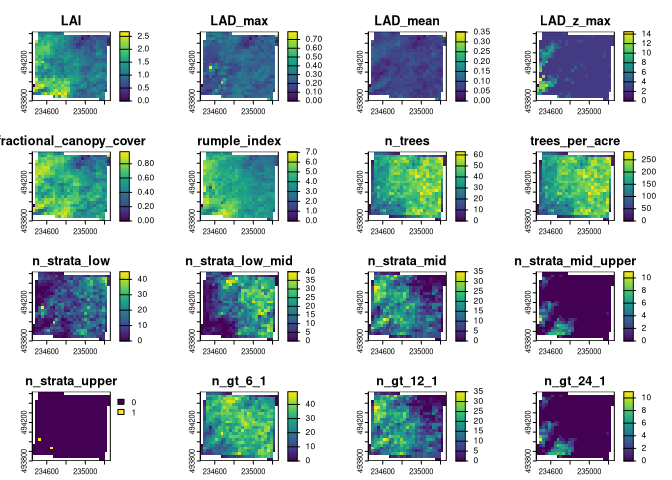

<!-- README.md is generated from README.Rmd. Please edit that file -->

# lidar.metrics

<!-- badges: start -->

<!-- badges: end -->

The goal of lidar.metrics is to provide multipurpose functions for
processing lidar point cloud tiles.

## Installation

You can install the development version of lidar.metrics from
[GitHub](https://github.com/) with:

``` r
# install.packages("remotes")
remotes::install_github("joshualerickson/lidar.metrics")
```

## Details

If using in parallel with `{future}`, we’ve noticed that you need to
namspace call the function (`lidar.metrics::`) when processing a catalog
(see below).

``` r

pixel_metrics(some_catalog,~lidar.metrics::connectivity_metrics_binned(X,Y,Z,
                                                                        voxel_res = 3,
                                                                     edge_thresh_values = c(3,3),
                                                                     z_40 = 12.1),
                          res=30)
```

## Example

This is a basic example which shows you how to use the functions in
lidar.metrics:

``` r
suppressMessages({
library(lidR)
library(terra)
library(lidar.metrics)
})

#load_graph_deps() # load for parallel snafu's

laz_test <- readLAS('data/testLAS.laz')
#> [                                                  ] -2147483648% ETA: -2147483648s     [                                                  ] -2147483648% ETA: -2147483648s     [                                                  ] -2147483648% ETA: -2147483648s     [                                                  ] -2147483648% ETA: -2147483648s     [                                                  ] -2147483648% ETA: -2147483648s     [                                                  ] -2147483648% ETA: -2147483648s     [                                                  ] -2147483648% ETA: -2147483648s     [                                                  ] -2147483648% ETA: -2147483648s     [                                                  ] -2147483648% ETA: -2147483648s     [                                                  ] -2147483648% ETA: -2147483648s     [                                                  ] -2147483648% ETA: -2147483648s     [                                                  ] -2147483648% ETA: -2147483648s     [                                                  ] -2147483648% ETA: -2147483648s     [                                                  ] -2147483648% ETA: -2147483648s     [                                                  ] -2147483648% ETA: -2147483648s     [                                                  ] -2147483648% ETA: -2147483648s     [                                                  ] -2147483648% ETA: -2147483648s     [                                                  ] -2147483648% ETA: -2147483648s     [                                                  ] -2147483648% ETA: -2147483648s     [                                                  ] -2147483648% ETA: -2147483648s     [                                                  ] -2147483648% ETA: -2147483648s     [                                                  ] -2147483648% ETA: -2147483648s     [                                                  ] -2147483648% ETA: -2147483648s     [                                                  ] -2147483648% ETA: -2147483648s     [                                                  ] -2147483648% ETA: -2147483648s     [                                                  ] -2147483648% ETA: -2147483648s     [                                                  ] -2147483648% ETA: -2147483648s     [                                                  ] -2147483648% ETA: -2147483648s     [                                                  ] -2147483648% ETA: -2147483648s     [                                                  ] -2147483648% ETA: -2147483648s     [                                                  ] -2147483648% ETA: -2147483648s     [                                                  ] -2147483648% ETA: -2147483648s     [                                                  ] -2147483648% ETA: -2147483648s     [                                                  ] -2147483648% ETA: -2147483648s     [                                                  ] -2147483648% ETA: -2147483648s     [                                                  ] -2147483648% ETA: -2147483648s     [                                                  ] -2147483648% ETA: -2147483648s     [                                                  ] -2147483648% ETA: -2147483648s     [                                                  ] -2147483648% ETA: -2147483648s     [                                                  ] -2147483648% ETA: -2147483648s     [                                                  ] -2147483648% ETA: -2147483648s     [                                                  ] -2147483648% ETA: -2147483648s     [                                                  ] -2147483648% ETA: -2147483648s     [                                                  ] -2147483648% ETA: -2147483648s     [                                                  ] -2147483648% ETA: -2147483648s     [                                                  ] -2147483648% ETA: -2147483648s     [                                                  ] -2147483648% ETA: -2147483648s     [                                                  ] -2147483648% ETA: -2147483648s     [                                                  ] -2147483648% ETA: -2147483648s     [                                                  ] -2147483648% ETA: -2147483648s                                                                                     

# if using a catalog feel free to do your pre-processing


# opt_filter(some_catalog) <- paste(
#   "-keep_class 1",              # only keep class 1 (unclassified, typically vegetation)
#   "-drop_class 7 9",            # drop noise and water
#   "-drop_withheld",            # drop withheld (often invalid points)
#   "-drop_z_below 0.3",         # avoid ground clutter
#   "-drop_z_above 12.1",        # truncate canopy top
#   "-drop_intensity_below 5",  # low signal = noise
#   "-drop_overlap",
#   "-keep_return 1",       # keep only first returns
#   "-drop_scan_angle_above 18",  # limit to near-nadir points
#   "-drop_scan_angle_below -18"  # limit to near-nadir points
# )
```

## Graph Theory Metrics

``` r

laz_graph_metrics <- pixel_metrics(laz_test, connectivity_metrics_binned(X, Y, Z, 
                                                              edge_thresh_values = c(3,3),
                                                              z_1 = 0.3, 
                                                              z_20 = 6.1, 
                                                              z_40 = 12.1,
                                                              psid =  PointSourceID,
                                                              voxel_res = 3), res = 30)
#> Warning in max(closeness_vals, na.rm = TRUE): no non-missing arguments to max;
#> returning -Inf
#> Warning in max(closeness_vals, na.rm = TRUE): no non-missing arguments to max;
#> returning -Inf

plot(laz_graph_metrics[[1:6]])
```



## Canopy Cover Metrics

``` r
# window function
wf <- function(x) {x*0.17 + 3}

laz_canopy_metrics <- suppressMessages(pixel_metrics(laz_test, canopy_cover_metrics(X, Y, Z,
                                                                                    psid = PointSourceID,
                                                                                    return_number = ReturnNumber,
                                                                                    window_func = wf), res = 30))

plot(laz_canopy_metrics)
```


